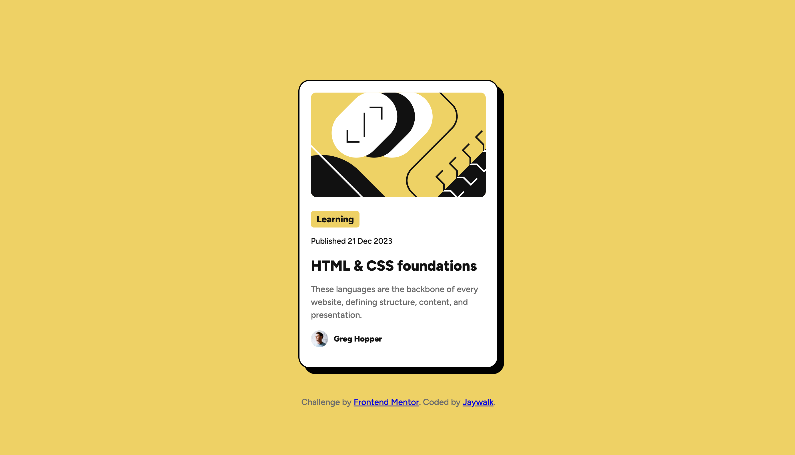

# Frontend Mentor - Blog preview card solution

This is a solution to the [Blog preview card challenge on Frontend Mentor](https://www.frontendmentor.io/challenges/blog-preview-card-ckPaj01IcS). Frontend Mentor challenges help you improve your coding skills by building realistic projects. 

## Table of contents

- [Overview](#overview)
  - [The challenge](#the-challenge)
  - [Screenshot](#screenshot)
  - [Links](#links)
- [My process](#my-process)
  - [Built with](#built-with)
  - [What I learned](#what-i-learned)
  - [AI Collaboration](#ai-collaboration)
- [Author](#author)

## Overview

### The challenge

Users should be able to:

- See hover and focus states for all interactive elements on the page

### Screenshot

### Links

- Solution URL: [Solution](https://github.com/jayyang358297/blog-preview-card-main.git)
- Live Site URL: [Live Site](https://jayyang358297.github.io/blog-preview-card-main/)

## My process

### Built with

- Semantic HTML5 markup
- CSS custom properties
- Flexbox
- CSS Grid

### What I learned

While working on this project, I learned how to use Flexbox to center a card both horizontally and vertically on the page. I also practiced using the CSS box model by combining padding, borders, border-radius, and box-shadow to recreate the card design.

I learned how to use `max-width` and percentage-based widths to make the card and its image adapt to different screen sizes. I also practiced importing a custom Google Font, using HSL color values, and creating a hover state for the card title.

## Author
- Frontend Mentor - [@Jaywalk](https://www.frontendmentor.io/profile/jayyang358297)
